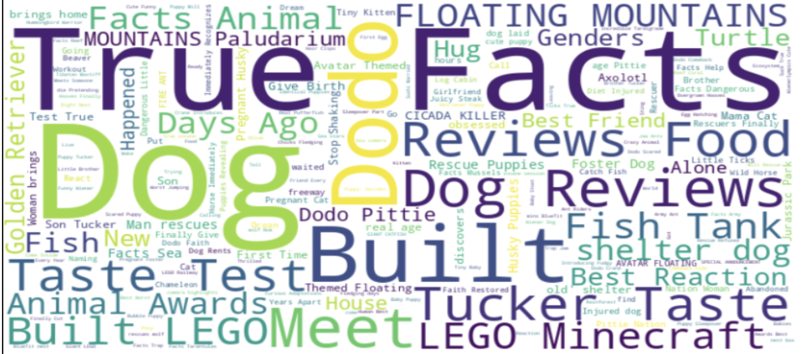
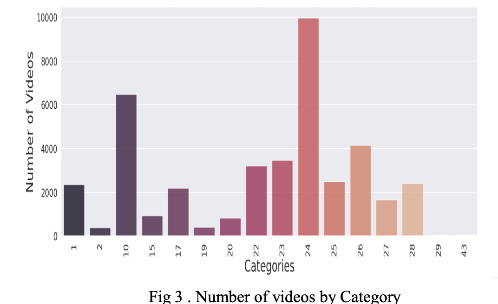
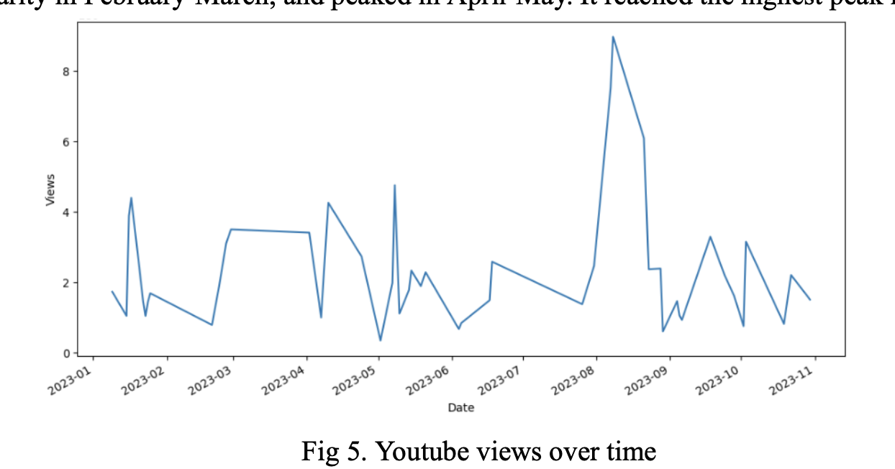

# Youtube-Trends
Project examining user behavior and content preferences on a global scale, utilizing exploratory data analysis, statistical analysis, and machine learning techniques.

## Abstract
This report,
"Analyzing Global YouTube Trends,
" intricately examines user behavior and content preferences on a
global scale. Investigating YouTube metrics like views, likes, and comments, the study delves into correlations,
trends, and genre-specific insights. Employing exploratory data analysis, statistical analysis, and machine learning
techniques, our research aims not only to understand current trends but also to predict future dynamics in the dynamic
realm of YouTube. Introducing the concept of "view velocity,
" defining the rate at which a specific video accrues
views relative to the days elapsed since its publication, we utilize regression models (Random Forest, Linear,
XGBoost, Lasso, KNN) and combine the results to enhance predictive capabilities, offering valuable insights for
content providers, marketers, and academics. This report serves as a comprehensive resource for stakeholders and a
foundation for future research in online media.

## Introduction
YouTube is a major force in reshaping digital content and user engagement. The platform's influence transcends
borders, making it an essential medium for both content providers and users. Our extensive dataset spans diverse
regions, providing daily updates on “top trending videos” from countries such as India, the USA, Great Britain,
Germany, Canada, France, Russia, Brazil, Mexico, South Korea, and Japan. With up to 200 trending videos per day
per region, this dataset enables cross-cultural comparisons, unveiling insights into global content trends.
Encompassing vital details like video titles, channel titles, views, likes, dislikes, descriptions, comment counts,
publishing date-time, and trending date-time, our dataset forms the cornerstone for a comprehensive analysis. The
inclusion of over 88 different languages within the US dataset alone, as revealed by a language detection model,
enhances our exploration, allowing us to delve into linguistic diversity and user preferences across distinct language
communities.
This study moves beyond exploration to gain profound insights into worldwide YouTube patterns. The analysis
extends to predicting the popularity of videos, and understanding when trends typically occur. Identifying popular
keywords and categorizing videos by genre further enrich our understanding of content preferences. Our research
methodology integrates exploratory data analysis, statistical analysis, and machine learning techniques to deepen the
understanding of current trends and predict future dynamics within the dynamic realm of YouTube.
Introducing the novel metric "view velocity,
" representing a video's rate of views accrual relative to the days elapsed
since its publication, our predictive modeling incorporates various regression models—Random Forest Regressor,
Linear Regression, XGBoost, Lasso Regression, and KNN Regressor. We used weighted averaging to get a final
accuracy of 83.66%. This multifaceted approach enhances the robustness and practicality of our findings, providing
actionable insights for content creators, marketers, and academics navigating the evolving landscape of YouTube
trends. This report, therefore, not only serves as a valuable resource for current stakeholders but also establishes a
groundwork for future research in the dynamic and ever-evolving realm of online media.

## Motivation
As a central player in digital media, YouTube's impact on user behavior, marketing strategies, and content creation
cannot be overstated. YouTube has a huge user base and has a big influence on a lot of different areas, including
marketing, entertainment, and information transmission [1], thus it's important to analyze its data. To make educated
decisions, regulators, advertisers, and content producers can understand trends, user preferences, and engagement
levels. Unraveling the correlations, trends, and predictive insights within YouTube's data contributes not only to
practical applications but also to the academic understanding of the evolving online media ecosystem.
Trending helps viewers see what’s happening on YouTube and in the world[10]. Trending aims to surface videos and
Shorts that a wide range of viewers would find interesting. Amongst the many great new videos on YouTube on any
given day, Trending can only show a limited number. Trending considers signals like View count, How quickly the
video is generating views (i.e.
“temperature”), Where views are coming from, including outside of YouTube, The age
of the video, and video performance compared to other recent uploads from the same channel. This article by
YouTube is the one we related to the most, and we tried to get these “Trending” videos using our prediction model.

## Related Work
In [2], YouTube data is fed into Google Analytics for artificial intelligence-based Big Data Analytics. Our goal is to
analyze this data, using a simple Jupyter Notebook. An analysis to help in discovering how people are performing on
YouTube is done[7][8], where one can fluently identify what content works best on YouTube. They used a random
forest regressor to predict the number of views for a given YouTube video[6]. By preprocessing the dataset and
utilizing visualization tools, the study reveals trends in popular video types and highlights a positive correlation
between viewership and subscriptions[9].
[11] explains how Deep Learning (DL) has historically been used in connection with YouTube. The approach is a
two-way split wherein a Deep Learning (DL) model is built and subsequently an independent recommendation system
is integrated to obtain recommendations via neural networks. It emphasizes exceptional performance and
advancements. The emphasis of [12] is on adjusting hyperparameters associated with Deep Learning (DL) models.
[14] investigates YouTube's trending algorithm using data mining techniques, revealing that factors such as "views,
"
"likes,
" "dislikes,
" and "comments" significantly influence a video's placement on the trending list, showcasing the
platform's diverse appeal for entertainment, education, and global information consumption.

## Methodology

We have worked on the US dataset containing ~ 42,000 data points. We started with exploratory data analysis to understand 
the dataset's structure, variables, and basic statistics, followed by preprocessing the data, encoding categorical variables,
 and cleaning textual data. A significant challenge we encountered was dealing with multilingual video data in various languages, 
 including English, Chinese, Spanish, Hindi, and more in each country's dataset. To address this, we incorporated a language 
 detection model (langid) to identify and add a new language column to the original dataset. For instance, in the US dataset, 
 language distribution includes English (en) 18,709, Spanish (es) 11,029, German (de) 4,684, Korean (ko) 4,208, Italian (it) 
 3,816, and 88 different languages in total. We also encoded categorical variables like comments_disabled, ratings_disabled, 
 video_error_or_removed. Also, the category of the videos was in a separate JSON file, with the original dataset only containing 
 the category ID. We used joins on those datasets to add categories of each video in the original dataset itself. Along with that,
  we dropped rows with inconsistencies such as likes being more than view_count as it is practically not feasible to have more likes
   to a video than the number of views a video had. Along with that, video titles were cleaned — we removed anything related to money 
   amount, non-alphanumeric tokens, and stopwords.

We have performed multiple data visualizations such as word-cloud (word cloud is a visual representation of a
collection of words, where the size of each word in the cloud corresponds to its frequency or importance in the given
text) showing the most frequent words, histograms for most trending video categories, category wise maximum
watched videos views, etc which are explained in the result section below. Furthermore, this report also delves into
engagement metrics, like the engagement rate, like-to-dislike ratio, comment-to-view ratio, likes per comment,
dislikes per comment, likes per day, and comments per day, to gain a comprehensive understanding of video
performance and user interaction trends.
In the context of our study, we introduce the concept of view velocity as a pivotal parameter, denoting the rate at
which a specific video accrues views relative to the days elapsed since its publication. The deliberate introduction of
this artificial parameter serves a crucial purpose within our scope. By incorporating view velocity, we inject a
temporal dimension into our analysis, acknowledging the significance of time in understanding the trajectory of a
video's popularity. This nuanced approach allows us to capture not only the quantitative aspects of view count but also
the temporal dynamics that contribute to a video's overall appeal and trending status.
Heatmaps are a powerful way to visualize the results of correlation analysis. We used a heat map to plot correlation
between all features and select features to predict view velocity. On the basis of the first heatmap, comment_count,dislikes, 
likes and comment_count had the most impact.
Now, We try to predict the view velocity of videos trending in the USA. A deliberate decision was made to opt for a
fixed, as opposed to a randomized, approach in our train-validation-test split. This strategic choice enhances our
ability to discern differences in model performance more reliably. By maintaining consistency across data subsets for
the models under scrutiny, any observed variations in performance can be confidently ascribed to the inherent
characteristics of the model or algorithm rather than fluctuations in the data split. This methodological approach not
only facilitates a more robust comparison among the five models but also mitigates issues related to data imbalance.
Additionally, it ensures a controlled and equitable distribution of data across the test, train, and validation split
datasets.
For predictive modeling, we initially trained five different models and then chose a model that was perfect for our
needs - understanding the data more effectively i.e. better accuracies and fewer errors. After splitting the data, we use
the same data across all five models namely: Random Forest Regressor, Linear Regression, XGBoost, Lasso
Regression, and KNN Regressor. The reasons for choosing these models are as stated below:
- Random Forest Regressor due to its ensemble nature, robustness to overfitting, and ability to capture
non-linear relationships can be crucial when predicting view velocity for YouTube videos, as viewer
engagement patterns may not follow a simple linear trend.
- Linear Regression provides a clear and interpretable relationship between input features and the target
variable. This can be useful for understanding the impact of individual features on view velocity.
- XGBoost is a boosting algorithm that sequentially builds weak learners and focuses on correcting errors made
by the previous models.
- Lasso Regression includes a penalty term that can lead to feature selection by setting some coefficients to
exactly zero. This can be useful for identifying the most important features related to view velocity.
- KNN is a non-parametric algorithm that does not make assumptions about the underlying distribution of the
data. It can capture complex relationships without assuming a specific functional form.
The ensemble of the selected regression models is expected to provide robust predictions for the task of predicting
view velocity for YouTube videos due to the complementary strengths of each model and the benefits gained from
ensemble methods.
Hyperparameters significantly influence the model's ability to learn patterns and make accurate predictions. In order
to get accurate results, we need to set out hyperparameters properly. So, we use a library called IPyWidget, which
helps create interactive plots. For every model, we can find the hyperparameters using the sliders that we have added
using this library. We then choose the hyperparameter that gives us the best results.

Evaluation of all these models involves calculating critical metrics such as Mean Squared Error (MSE) and Accuracy.
We will then choose a model which will suit our needs. Evaluation of the ensemble bagged model involves applying
the same metrics and visualizations that we used for individual regression models.

## Emperical Results
a. WordClouds: We used WordCloud to visualize the most frequent words in the titles for each category. We grouped 
the data using categories in the dataset, and then passed titles to create multiple word clouds for different categories.

b. Histogram: We used histograms to depict trending videos and likes category wise in the US dataset.

c. Youtube views over time: We consider “Sports category for explanation purposes. The graph depicts how
number of views for youtube videos in the category change w.r.t. time. The videos taken into consideration are of the
year 2023 and belong to the “Sports” category. The graph shows that the video had a slow start, but it started to gain
popularity in February-March, and peaked in April-May. It reached the highest peak in August.

d. Correlation analysis using Heatmaps: The heatmap shows that the view_count column is strongly correlated with the likes
and the comment_count. Videos with more views tend to have more likes and comments. The heatmap also shows that the likes 
and the comment_count are strongly correlated. Videos with more likes tend to have more comments. The dislikes are weakly 
correlated with the other columns. This means that videos with more dislikes tend to have fewer views, likes, and comments. 
Overall, As there is a strong positive correlation between view_count, likes and comment_count, it indicated videos with more 
views tend to have more likes and comments.

e. View Velocity Prediction: After tuning the hyperparameters and training the models, we observed the following-

We can see the difference between accuracies of the model which can be justified as-
The Random Forest model achieves an extremely high accuracy. Despite its high accuracy, the model exhibits a low
MSE, indicating that the predicted values are generally close to the actual values. However, there might be some
instances with larger prediction errors. Low MSE for XGBoost indicates that the predicted values are very close to the
actual values, suggesting superior performance in terms of regression and predictive accuracy.
Lasso Regression's accuracy is comparable to Linear Regression, indicating similar classification challenges. This
suggests that it struggles to correctly classify instances, possibly due to the nature of the problem or the features used.
KNeighbors Regression has the lowest accuracy among the models, indicating challenges in correctly classifying
instances, possibly due to its sensitivity to the dataset's structure.
Combining predictions with weighted averaging involves assigning different weights to the predictions of individual
models based on their performance. Models with better performance contribute more to the final prediction, ensuring
that more reliable predictions have a greater influence on the ensemble. Weighted averaging allows the ensemble to
adapt to the strengths of each model, leading to a more well-rounded prediction. We tried doing this with our five
models, where weights were the accuracies of each individual model. The final accuracy that we got using this
combined model was - 83.66
The scatter plot (Fig 9) compares actual and predicted view velocity of the new ensemble model. Also, we then used this new model
 to get the videos that it thinks will be trending in 2023(Fig 10).

 

## Conclusion
In conclusion, our exhaustive analysis of global YouTube trends, incorporating exploratory data analysis, regression
modeling, and weighted averaging, has provided profound insights into user behaviors and content preferences. The
introduction of the innovative metric "view velocity" allowed for a dynamic understanding of video popularity, and
the ensemble of carefully selected regression models demonstrated robust predictive capabilities. The strategic use of
a fixed train-validation-test split enhanced model comparisons, while visualizations such as word clouds and temporal
analyses enriched the comprehension of content landscapes and engagement dynamics. Serving as a valuable
resource, this study not only aids current decision-making in the realms of content creation and marketing but also
lays a solid foundation for future research in the dynamic domain of online media ecosystems

## References

1. M. Laeeq Khan and Aqdas Malik, *“Research YouTube: Methods, Tools, Analytics”*, September 2022.

2. Krishna Bhargava Anantharamaiah, *“YouTube Analytics Using Google Data Studio”*, August 2020.

3. [YouTube Trending Video Dataset (updated daily)](https://www.kaggle.com/datasets/rsrishav/youtube-trending-video-dataset?select=US_youtube_trending_data.csv).

4. [Global YouTube Statistics 2023](https://www.kaggle.com/datasets/nelgiriyewithana/global-youtube-statistics-2023).

5. [Trending YouTube Video Statistics](https://www.kaggle.com/datasets/datasnaek/youtube-new?select=CAvideos.csv).

6. Eliganti Ramalakshmi, A Bindhu Sree Reddy, Sharvani G, *“YouTube Data Analysis and Prediction of Views and Categories”*, May 2022.

7. Bärtl M., *“YouTube channels, uploads and views: A statistical analysis of the past 10 years”*, 2018.

8. Che, X., Ip, B., Lin, L., *“A Survey of Current YouTube Video Characteristics”*, 2022.

9. Jiali Fan; Tingru Lian, *“YouTube Data Analysis using Linear Regression and Neural Network”*, April 2022.

10. [YouTube’s own article on trending videos](https://support.google.com/youtube/answer/7239739?hl=en#:~:text=Trending%20helps%20viewers%20see%20what%27s,of%20viewers%20would%20find%20interesting.&text=The%20list%20of%20trending%20videos,same%20position%20in%20the%20list).

11. Covington, P., Adams, J., & Sargin, E., *“Deep neural networks for YouTube recommendations”*. In Proceedings of the 10th ACM conference on recommender systems (pp. 191-198), September 2016.

12. Yaseen, M. U., Anjum, A., Rana, O., & Antonopoulos, N., *“Deep Learning (DL) hyper-parameter optimization for Video Analytics (VA) in clouds”*. IEEE Transactions on Systems, Man, and Cybernetics: Systems, 49(1), 253-264, 2018.

13. Bhatnagar, Deshak, and Siddhaling Urolagin, *“YouTube Video Popularity Analysis & Prediction Using Deep Learning”*. *International Journal of Computational Intelligence in Control*, 13(2), 127-134, 2021.

14. J. F. Andry, S. A. Reynaldo, K. Christianto, F. S. Lee, J. Loisa, and A. B. Manduro, *“Algorithm of Trending Videos on YouTube Analysis using Classification, Association and Clustering”*. 2021 International Conference on Data and Software Engineering (ICoDSE), Bandung, Indonesia, 2021, pp. 1-6, doi: [10.1109/ICoDSE53690.2021.9648486](https://doi.org/10.1109/ICoDSE53690.2021.9648486).

15. Mohr, Iris, *“Going viral: An analysis of YouTube videos”*. *Journal of Marketing Development and Competitiveness*, 8(3), 43, 2014.
